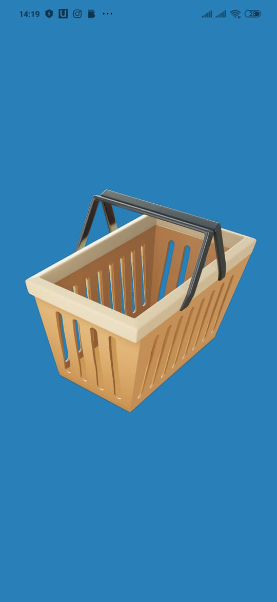

<div align="center">
	
	<br/>
	<br/>
</div>

<p>
  <a href="#-sobre-o-projeto">📇 Sobre o projeto</a>
  <br/>
  <a href="#-tecnologias">🧰 Tecnologias</a>
   <br/>
   <a href="#-scripts">🔎 Scripts</a>
   <br/>
  <a href="#-como-utilizar">🏎️ Como utilizar</a>
   <br/>
  <a href="#-como-contribuir">🤝 Como contribuir</a>
   <br/>
  <a href="#-licença">📝 Licença</a>
</p>


# 📇 Sobre o projeto

Basket, o aplicativo que veio para te ajudar na hora de ir ao supermercado, afinal quem numa esqueceu  de comprar algo e só lembrou apenas  quando chegou em casa. Pensando nisso possibilitando ao nosso usuários criar uma lista de compras personalizada de acordo suas necessidades, proporcionando adicionar itens e marcar o item como feito após adicionar a cesta de compras.


<div align="center">
	
</div>


# 🧰 Tecnologias

*Mobile 

  * React

  * React native

  * Typescript    

# 🔎 Scripts

**Mobile**
 - `expo start`: 
 
 Roda a aplicação em modo de desenvolvimento


 ```
# ⚙️ Como utilizar

Clone o repositório:
```
git clone git clone https://github.com/CELS0/basket
```
Instale as dependências:

📁/basket
```
yarn
```
## Mobile Preparando ambiente
```
Primeiros passos:

Instalar as dependêcias:
instalação do expo na máquina 

https://docs.expo.dev/get-started/installation/

📁/basket

```
expo start
```

# 🤝 Como contribuir

- Faça um fork desse repositório;
- Clone esse repositório em sua máquina: `git clone https://github.com/CELS0/basket`
- Cria uma branch com a sua feature: `git checkout -b minha-feature`;
- Faça commit das suas alterações: `git commit -m 'feat: Minha nova feature'`;
- Faça push para a sua branch: `git push origin minha-feature`.

Depois que o merge da sua pull request for feito, você pode deletar a sua branch.


# 📝 Licença

Esse projeto está sob a licença MIT. Veja o arquivo LICENSE para mais detalhes.